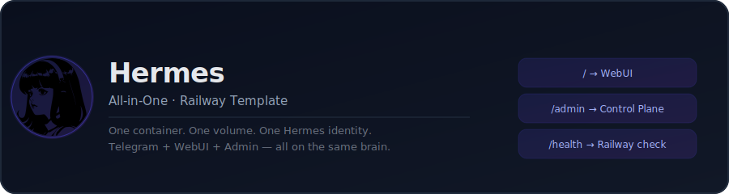
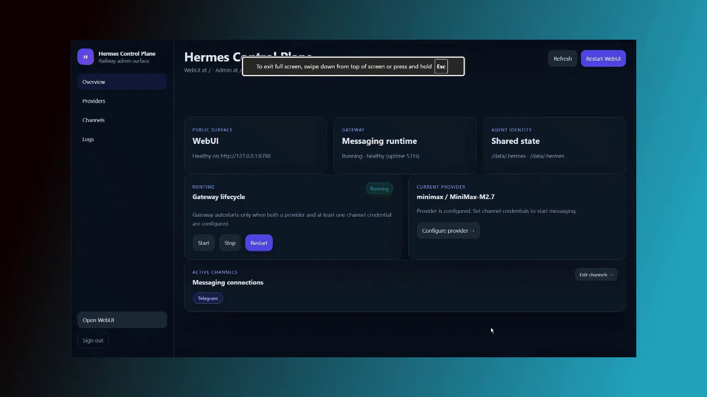
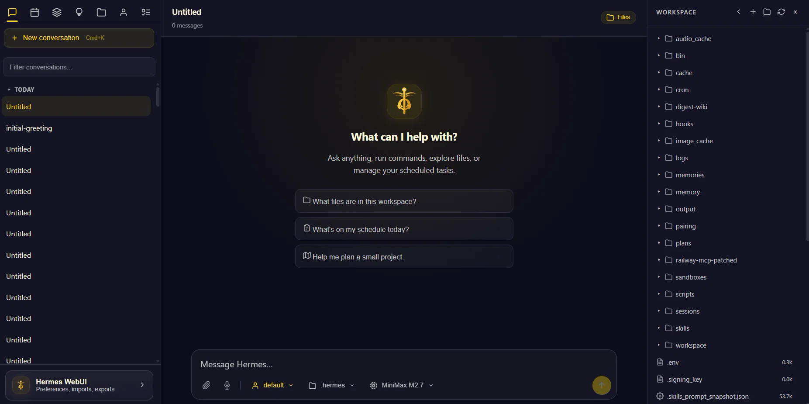

# Hermes All-in-One | WebUI + Admin Panel + Gateway — No Terminal Setup

> **Browser-based setup at `/admin` — no terminal, no config files.**
> One container, one shared agent identity across WebUI, Telegram, Discord, and Slack. Persistent memory, built-in skills, cron automations ready on deploy.

[](https://railway.com/deploy/hermes-all-in-one-or-webui-admin-panel-g?referralCode=1uw5HI)

---

## ⚡ First time here? Go to `/admin` — not `/`

When you deploy this, your app opens at `/`. That's the Hermes WebUI — but it needs a password and a configured AI provider to work. **You must configure it first at `/admin`.**

```
https://your-app.railway.app/admin
```

Log in with `HERMES_ADMIN_PASSWORD` (or `HERMES_WEBUI_PASSWORD` if admin password isn't set). This is where you set your API key, connect Telegram, and start the gateway.

---

## What is this?

[Hermes Agent](https://github.com/NousResearch/hermes-agent) is a self-improving AI agent from NousResearch — it can use tools, remember things, and talk to you over multiple channels. This repo packages it into a single Railway-deployable container with:

| Surface | URL | What it is |
|---------|-----|-----------|
| **WebUI** | `/` | Hermes chat interface in the browser |
| **Control Plane** | `/admin` | Provider + channel setup, gateway controls, logs |
| **Health** | `/health` | Railway health check endpoint |

Everything shares one Hermes identity — the same memory, skills, config, and SOUL file — whether you're talking on Telegram or in the browser.

---

## Screenshots

**Admin Control Plane** — `/admin`



**Hermes WebUI** — `/`



---

## Quick Deploy

### 1. Deploy to Railway

Click the button above or create a new Railway service from this repo manually.

### 2. Add a volume

In Railway → your service → **Volumes** tab → mount a persistent volume at `/data`.

> Without a volume, all your agent memory, config, and credentials are lost on every redeploy.

### 3. Set required environment variables

Go to **Variables** in your Railway service and set at minimum:

```
HERMES_WEBUI_PASSWORD=your-secure-password
HERMES_ADMIN_PASSWORD=your-admin-password
```

### 4. Deploy

Railway builds the Dockerfile and starts the container. The control plane at `/admin` is ready in ~30 seconds.

### 5. Configure your AI provider at `/admin`

Go to `/admin` → **Providers** → pick your provider → enter your API key → Save.

### 6. (Optional) Connect Telegram

Go to `/admin` → **Channels** → enter your bot token and your numeric Telegram user ID → Save.

The gateway starts automatically once both provider and channel are configured.

---

## Your First Prompts

Hermes is deployed but blank. It doesn't know who you are, what you need, or how you work. The first 10 minutes are the most important — they shape how the agent behaves for the rest of its life on your machine.

### Prompt 1 — Self-optimize for a first-time user

Paste this as your very first message. It tells Hermes to read its own documentation, understand its full capabilities, and then guide you through setup like a pro:

```
Use your hermes-agent skill and help me with first-time setup.
Read your own documentation, understand what you're capable of,
then walk me through how to make you as useful as possible for
someone who just deployed you for the first time.
Start by asking me what I do, what I want to automate, and what
kind of help I need daily. Then suggest what to set up first.
```

Hermes will read its own skill files, explain what it can do, and interview you before recommending what to build.

---

### Prompt 2 — The onboarding interview

After the first prompt, paste this to give Hermes everything it needs to understand you as a person. A well-briefed agent is 10x more useful than a blank one:

```
I want to brief you on who I am so you can serve me better.
Ask me these questions one at a time, wait for my answer,
then move on:

1. What do you do for work or what are you building?
2. What's your biggest time drain right now?
3. What do you wish you had a daily assistant for?
4. What tools or platforms do you use most (Notion, Gmail, Telegram, etc.)?
5. What's something you've always wanted to automate but never had time to set up?

After I answer all five, write a brief summary of who I am,
save it to your memory, and suggest the three most valuable
things to set up first based on my answers.
```

This seeds Hermes' memory with your context. Every future conversation builds on it.

---

### Prompt 3 — Install your first skill

Hermes ships with a skills system — modular "instruction packs" that teach it how to do specific things (use certain tools, follow specific workflows, talk to specific APIs). There are hundreds of community skills at [agentskills.io](https://agentskills.io).

To see what's available and install something useful immediately:

```
Show me your available skills with /skills.
Then browse the skills hub and find me something
useful for [your goal — e.g. "web research", "email drafting",
"daily briefings", "job hunting"].
Install the most relevant one and show me how to use it.
```

Or install a specific skill directly:
```
/skills install arxiv
/skills install github-code-review
/skills install web-research
```

Once installed, skills activate automatically when relevant — or you can call them explicitly with `/skill-name`.

---

## Starter Automations

These are the highest-value things to set up in your first hour. Each one is a real working prompt you can send to Hermes as-is.

---

### Client Hunter (B2B / freelancers)

Hermes monitors job boards, LinkedIn searches, or RSS feeds and sends you a digest of prospects matching your criteria — every morning, to Telegram.

**Setup prompt:**
```
Set up a daily client hunting automation for me.

My service: [describe what you sell — e.g. "React development", "copywriting", "SEO consulting"]
My ideal client: [describe — e.g. "early-stage SaaS startups", "e-commerce brands over $1M revenue"]

Search LinkedIn, Upwork, and relevant job boards for new posts matching this.
Filter for posts from the last 24 hours only.
Send me a Telegram digest every morning at 8am with:
- Company name and link
- What they're looking for
- Why it's a match for me
- A suggested 2-sentence cold opener I could use

Name this automation "Client Hunter" and show me the cron schedule.
```

---

### Job Seeker (career transition / active search)

Hermes monitors multiple job boards for your target roles, deduplicates across sites, and delivers a curated shortlist to Telegram daily.

**Setup prompt:**
```
Build me a daily job search automation.

Target role: [e.g. "Senior Product Manager", "Full Stack Developer", "Growth Marketing Lead"]
Preferred companies: [e.g. "Series A-C startups, remote-first, fintech or developer tools"]
Deal-breakers: [e.g. "no agencies, no relocation required, no Java"]

Search LinkedIn Jobs, Wellfound, and Greenhouse postings from the last 48 hours.
Rank results by how closely they match my profile.
Send me a Telegram digest every weekday at 7am with:
- Job title, company, and direct application link
- Salary range if listed
- Why it's a strong/medium/weak match
- One thing I should customize in my application for each

Name this "Job Seeker Daily" and activate it.
```

---

### Daily Intelligence Feed (RSS + AI curation)

Instead of doom-scrolling through 20 RSS feeds, Hermes reads everything and sends you a curated 5-item briefing on what actually matters — filtered for your interests.

**Setup prompt:**
```
Create a daily intelligence briefing that runs every morning at 7am and delivers to Telegram.

My interests: [e.g. "AI/ML, indie hacking, startup funding news, productivity tools"]
What I want to skip: [e.g. "politics, sports, crypto price updates, press releases"]

Pull from these sources:
- Hacker News top 10
- TechCrunch, The Verge (recent posts)
- Any relevant subreddits: r/MachineLearning, r/entrepreneur
- arXiv CS papers if there are any trending

For each item include:
- Title and link
- 2-sentence summary
- Why it's relevant to me personally
- A "so what" — what action or insight does this give me?

Limit to the 5 most relevant items. Skip anything I've likely already seen.
Name this "Morning Briefing" and schedule it.
```

---

### Skill Creator (build your own tools)

This is the meta-skill: teach Hermes how to teach itself. After completing a complex task, Hermes can write a skill that makes it faster next time — permanently.

**Trigger it manually after any successful task:**
```
That worked well. Write a skill that captures this workflow
so you can do it faster next time without needing my instructions.
Give it a clear name and description, then save it to your skills folder.
```

**Or turn it on permanently:**
```
From now on, after every multi-step task you complete successfully,
write a skill file that captures the approach so you can improve on it next time.
Check your existing skills first to avoid duplicates.
Update existing skills if you found a better way to do something.
```

This is Hermes' self-improvement loop — it literally rewrites its own procedures from experience.

---

## How the Skills System Works

Skills are already running. Nothing to set up.

Hermes ships with a full library of built-in skills covering research, GitHub, email, feeds, diagramming, social media, note-taking, productivity tools (Notion, Linear, Google Workspace), devops, data science, and more. Every time you start a conversation, Hermes scans its skills directory, builds an index of everything available, and injects it into its own system prompt. It knows what it can do before you say a word.

When you ask it something that matches a skill — "review this PR", "summarize these papers", "draft a LinkedIn post" — it loads that skill's procedures automatically. You don't invoke it. It just picks up the right tool for the job.

**A skill is a Markdown file.** Name, description, version, and a set of instructions the agent follows when it activates. That's it. The system is intentionally simple so you can read, edit, and write them yourself.

```
/data/.hermes/skills/
  github-code-review/
    SKILL.md         ← instructions + frontmatter
    references/      ← optional supporting docs
```

**Beyond the built-ins, there are two more layers:**

**Optional skills** ship with Hermes but aren't active by default — niche integrations, heavier dependencies, things only some users need. Browse and install them in one command:
```
/skills                           # see everything active
/skills install arxiv             # add from the optional library
/skills install github-pr-workflow
```

**Community skills** at [agentskills.io](https://agentskills.io) — an open standard anyone can publish to. Same install flow, same format:
```
/skills search "cold email"
/skills install cold-email-outreach
```

And if none of that covers what you need, ask Hermes to write a skill from scratch. Describe the workflow once, tell it to save it as a skill, and it handles the file. Next time, it follows the procedure without you re-explaining anything.

---

## How the Self-Learning Loop Works

Hermes has a closed learning loop built into the agent. This is what makes it different from a stateless chatbot:

**1. Memory nudges.** After complex conversations, the agent notices what it learned about you and prompts itself to save it. You don't have to remember to say "save that" — it just does.

**2. Session search.** Hermes indexes every conversation with FTS5 full-text search. Ask it something it learned in a conversation from two weeks ago and it can find it. Use `/insights` to see what it knows about you.

**3. Automatic skill creation.** After completing a complex multi-step task, Hermes can recognize that it just learned a repeatable procedure and write a skill from it. The next time you ask for the same thing, it's faster because it's following a procedure it wrote itself.

**4. User modeling.** Via [Honcho](https://github.com/plastic-labs/honcho), Hermes builds a model of who you are — your preferences, working style, what you care about — and adjusts how it responds over time.

**5. Skill improvement.** When Hermes uses a skill and finds a better approach, it updates the skill. Skills get sharper the more you use them.

The practical result: the longer you run Hermes, the more capable it gets at your specific workflows. It's not the same agent in month 3 that it was on day 1.

---

## How Scheduling Works

Hermes has a built-in cron scheduler. Schedule anything in natural language:

```
hermes cron create "every day at 8am" "your prompt here" --name "My Task" --deliver telegram
```

Or with a cron expression:
```
hermes cron create "0 8 * * 1-5" "your prompt here" --name "Weekday Briefing" --deliver telegram
```

**Delivery targets:**
```
--deliver telegram          # your Telegram home channel
--deliver discord           # your Discord home channel
--deliver slack             # your Slack channel
--deliver local             # save to file, no notification
```

**Power feature: script injection.** Run a Python script before the agent runs. The script's output becomes context the agent can reason about. Use this to fetch data, diff files, or do any mechanical work before handing off to the LLM:

```
hermes cron create "every 1h" \
  "If CHANGE DETECTED, summarize what changed and why it matters. If NO_CHANGE, respond with [SILENT]." \
  --script ~/.hermes/scripts/watch-prices.py \
  --name "Price Monitor" \
  --deliver telegram
```

The `[SILENT]` pattern is key — Hermes only sends a notification when something actually changes. Zero spam.

**Chain skills into automations:**
```
hermes cron create "0 9 * * *" \
  "Search for top AI papers from yesterday. Summarize the top 3 and save as notes." \
  --skills "arxiv,obsidian" \
  --name "Daily Paper Digest" \
  --deliver telegram
```

Full scheduling docs: [hermes-agent.nousresearch.com/docs/user-guide/features/cron](https://hermes-agent.nousresearch.com/docs/user-guide/features/cron)

---

## Environment Variables

### Required

| Variable | Description |
|----------|-------------|
| `HERMES_WEBUI_PASSWORD` | Password for the WebUI at `/` |
| `HERMES_ADMIN_PASSWORD` | Password for `/admin` (falls back to WebUI password if unset) |

### AI Provider (set via `/admin` UI or manually)

| Variable | Description |
|----------|-------------|
| `OPENROUTER_API_KEY` | For OpenRouter (recommended — access to all models) |
| `ANTHROPIC_API_KEY` | For Anthropic direct |
| `OPENAI_API_KEY` | For OpenAI or custom OpenAI-compatible endpoints |

### Telegram (set via `/admin` UI or manually)

| Variable | Description |
|----------|-------------|
| `TELEGRAM_BOT_TOKEN` | Your bot token from [@BotFather](https://t.me/BotFather) |
| `TELEGRAM_ALLOWED_USERS` | Comma-separated numeric user IDs allowed to chat |

### Gateway behavior

| Variable | Default | Description |
|----------|---------|-------------|
| `HERMES_GATEWAY_AUTOSTART` | `auto` | `auto` = start when provider + channel ready; `off` = never autostart |

### Internal paths (don't change these unless you know why)

| Variable | Default |
|----------|---------|
| `HERMES_HOME` | `/data/.hermes` |
| `HERMES_CONFIG_PATH` | `/data/.hermes/config.yaml` |
| `HERMES_WEBUI_STATE_DIR` | `/data/webui` |
| `HERMES_WORKSPACE_DIR` | `/data/workspace` |
| `PORT` | `8787` |

---

## Provider Setup Guide

### OpenRouter (recommended for beginners)

OpenRouter gives you a single API key that accesses Anthropic, OpenAI, Mistral, Google, and hundreds of other models. Create an account at [openrouter.ai](https://openrouter.ai), add credits, copy your API key.

In `/admin` → Providers:
- Provider: **OpenRouter**
- Model: `anthropic/claude-sonnet-4-6` (or any model from their catalog)
- API Key: your OpenRouter key

### Anthropic Direct

Get a key from [console.anthropic.com](https://console.anthropic.com).

In `/admin` → Providers:
- Provider: **Anthropic**
- Model: `claude-sonnet-4-6`
- API Key: your `sk-ant-...` key

### OpenAI Direct

Get a key from [platform.openai.com](https://platform.openai.com).

In `/admin` → Providers:
- Provider: **OpenAI**
- Model: `gpt-4o`
- API Key: your `sk-...` key

### Custom OpenAI-compatible endpoint

For Ollama, LM Studio, vLLM, Together, Groq, or any OpenAI-compatible API:

In `/admin` → Providers:
- Provider: **Custom OpenAI-compatible**
- Model: whatever your endpoint expects
- API Key: your key (or `ollama` for local Ollama)
- Base URL: `https://your-endpoint.com/v1`

### OpenAI Subscription / ChatGPT account login (advanced)

> **Disclaimer:** This uses your personal ChatGPT account via Railway's SSH terminal. It works but is fragile — OpenAI may change their auth flow at any time. Use at your own risk. Your credentials are stored only in your container's `/data` volume.

OAuth-style and subscription-based provider flows (ChatGPT, Codex, Nous Portal) can't be completed in the browser on Railway. Use the Railway CLI instead:

```bash
# Install Railway CLI
npm install -g @railway/cli

# Log in
railway login

# SSH into your running service
railway ssh

# Inside the container, run Hermes auth
hermes auth login
# Follow the prompts — this stores credentials in /data/.hermes
```

After completing auth in the terminal, go back to `/admin` and the provider should appear as configured.

---

## Telegram Setup Guide

### Step 1: Create a bot

1. Open Telegram, search for [@BotFather](https://t.me/BotFather)
2. Send `/newbot` and follow the prompts
3. Copy the bot token (looks like `123456789:ABCdef...`)

### Step 2: Find your numeric user ID

1. Open Telegram, search for [@userinfobot](https://t.me/userinfobot)
2. Start the bot — it replies with your numeric ID (e.g. `123456789`)

> Important: Telegram user IDs are **numbers**, not usernames. `@yourhandle` won't work — you need the numeric ID.

### Step 3: Configure in `/admin`

Go to `/admin` → **Channels** → **Telegram**:
- Bot token: paste your BotFather token
- Allowed user IDs: your numeric ID (comma-separate for multiple users)
- Save

The gateway starts automatically. Send `/start` to your bot on Telegram — it should respond.

---

## Your Agent's Identity — SOUL.md

`SOUL.md` controls the agent's persistent persona and behavior — its name, how it speaks, what it cares about. In this template it lives at `/data/.hermes/SOUL.md` on the persistent volume.

Edit it directly from the Hermes WebUI, then restart the gateway from `/admin` → Overview → **Restart** to apply changes.

For full formatting guidance, persona examples, and what `SOUL.md` can control, see the [Hermes Agent documentation](https://github.com/NousResearch/hermes-agent).

---

## Memory & Sessions

Hermes remembers everything in `/data/.hermes/`:

```
/data/.hermes/
  config.yaml        ← provider + model config
  .env               ← channel credentials (tokens, API keys)
  sessions/          ← conversation history per channel
  skills/            ← agent skills and tools
  SOUL.md            ← agent identity
```

The WebUI and Telegram gateway share this directory. That means:
- Your agent remembers Telegram conversations when you switch to WebUI
- Skills you add via one surface are available on the other
- One personality, two frontends

Back up `/data` entirely — not just `/data/.hermes`.

---

## Use Cases & Patterns

### Personal AI assistant on Telegram
Set `TELEGRAM_ALLOWED_USERS` to just your own ID. Use your agent for research, writing, brainstorming, and task tracking — all in your normal Telegram flow. Your conversations persist across reboots.

### Team knowledge base assistant
Add multiple user IDs to `TELEGRAM_ALLOWED_USERS`. Give the agent a custom SOUL.md as a team expert in your domain. Point it at your docs using Hermes skills.

### Automated task runner
Use the Hermes skills system to give your agent tools — file access, API calls, code execution. Trigger tasks over Telegram or the WebUI.

### Multi-channel bot
Configure Telegram + Discord + Slack simultaneously (all supported by the gateway). One agent responds across all channels with shared memory.

### Development sandbox
Keep `HERMES_GATEWAY_AUTOSTART=off`, deploy once, and use the WebUI exclusively for development and testing. Toggle the gateway on only when you're ready to go live.

---

## Tips from the field

**On first deploy, go straight to `/admin`** — not `/`. The WebUI at `/` requires a working provider before it's useful.

**Use OpenRouter for experimenting** — swap models without changing your deployment. Try Claude for reasoning, Mistral for speed, local models for privacy.

**Don't share your Telegram bot token in public repos.** Use Railway environment variables, not `.env` files committed to git.

**Your agent's `SOUL.md` is the highest-leverage file you'll ever write.** 200 words of well-crafted identity beats 2000 words of prompt injection in system prompts.

**Volume = memory.** If you delete the Railway volume, your agent forgets everything. Back up `/data` before destructive Railway operations.

**The gateway health check is time-based, not HTTP.** Hermes gateway is a Telegram bot process — it's healthy if it's been running without crashing for ≥3 seconds. No HTTP endpoint to probe.

**Password protect everything before sharing the URL.** Both `HERMES_WEBUI_PASSWORD` and `HERMES_ADMIN_PASSWORD` should be set before the service is public.

---

## Architecture Overview

```
Railway service (single container)
│
├── PID 1: Starlette control plane (:8787, public)
│   ├── / → proxy to internal WebUI
│   ├── /admin → control plane UI
│   └── /health → Railway health check
│
├── Internal: Hermes WebUI (:8788, loopback only)
│   └── imports hermes-agent directly via sys.path
│
└── Optional: Hermes gateway (subprocess)
    └── connects to Telegram / Discord / Slack
        └── reads /data/.hermes (shared with WebUI)
│
Volume: /data
  ├── .hermes/   ← agent identity, memory, config
  ├── webui/     ← WebUI state
  └── workspace/ ← agent workspace
```

The control plane is a thin Starlette wrapper — not a framework, not a product. It exists to:
1. Proxy WebUI behind auth
2. Expose `/admin` for initial setup
3. Manage the gateway process lifecycle

---

## Credits

This repository is a Railway deployment wrapper. All agent and WebUI logic lives upstream:

- **[Hermes Agent](https://github.com/NousResearch/hermes-agent)** — agent runtime by NousResearch
- **[Hermes WebUI](https://github.com/NousResearch/hermes-webui)** — browser chat interface by NousResearch
